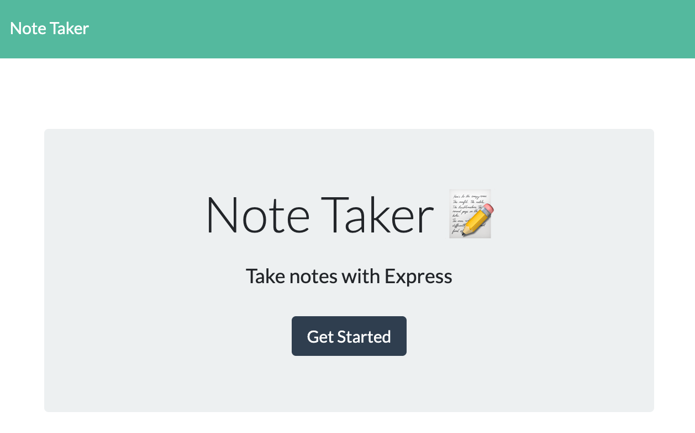
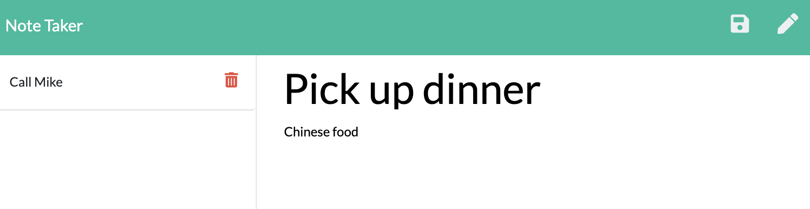

# Note Taker


## Description

This is a note taking app that allows users to store, review, and delete notes.

## Table of Contents

- [Installation](#installation)
- [Usage](#usage)
- [License](#license)
- [Contributing](#contributing)
- [Questions](#questions)

## Installation

To install the dependencies, run the command below:

```
npm i
```

## Usage

To add/view notes simply click 'Add Notes', enter the title and details of your note, then click save.


To delete a note click the red trash can button next to the note.


## License

```
MIT
```

## Contributing

Simply make a Pull Request and include screenshots and a detailed description.

## Questions


If you have any questions about the repo, open an issue or contact [jkaplanis](https://github.com/jkaplanis) directly at [johntkaplanis@gmail.com](mailto:johntkaplanis@gmail.com).
